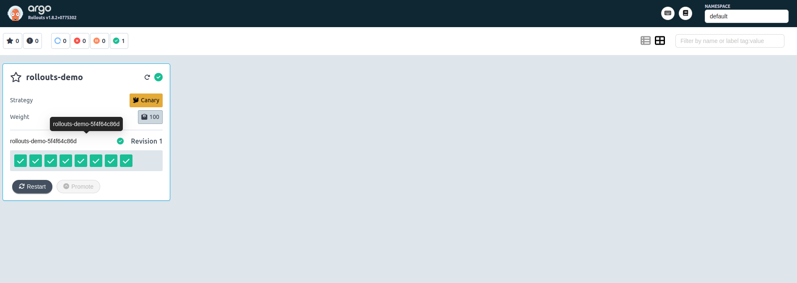
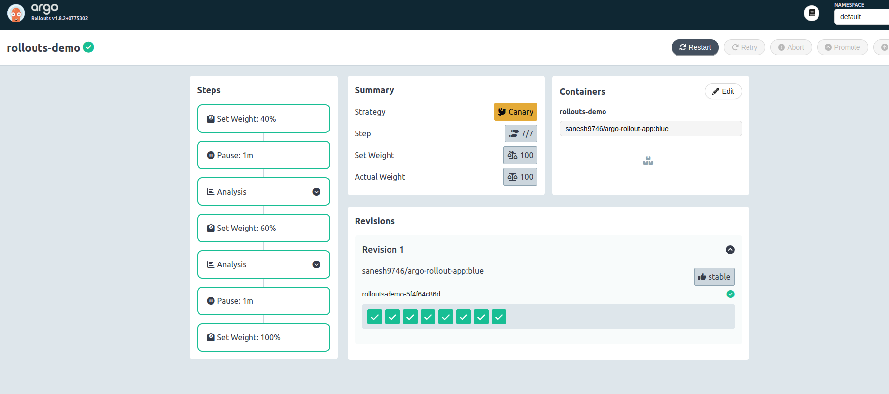
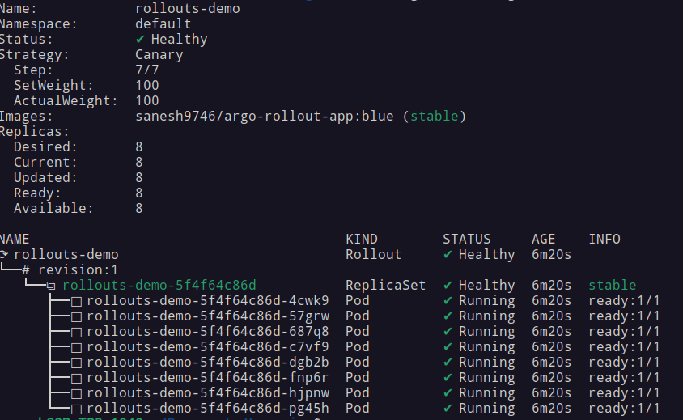
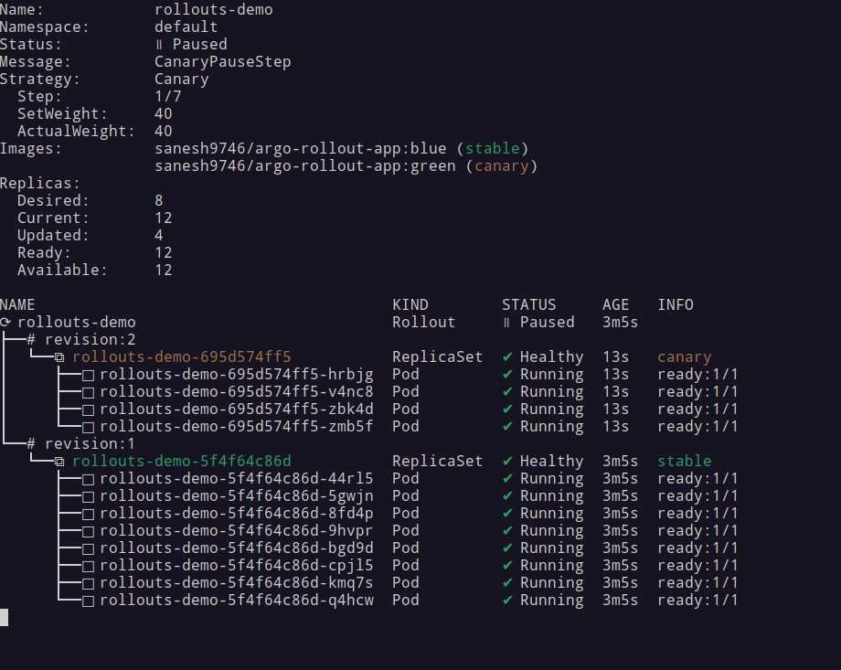
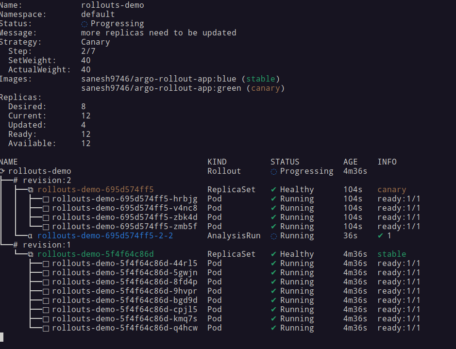
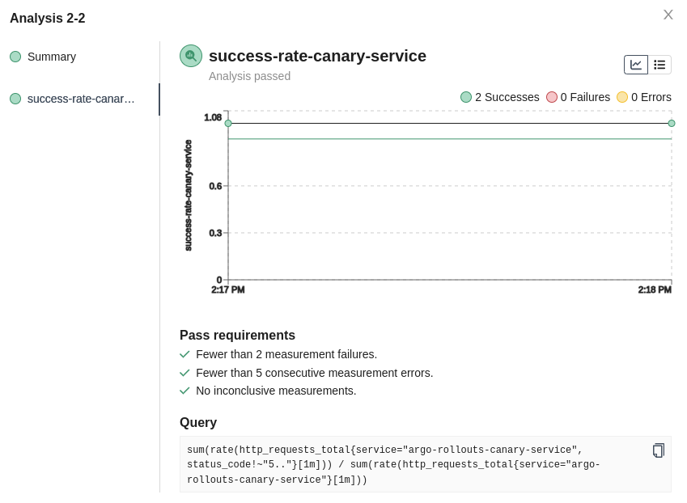
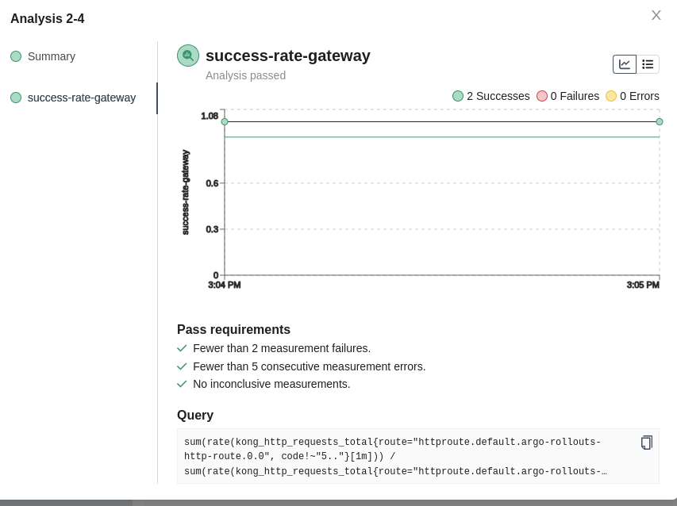
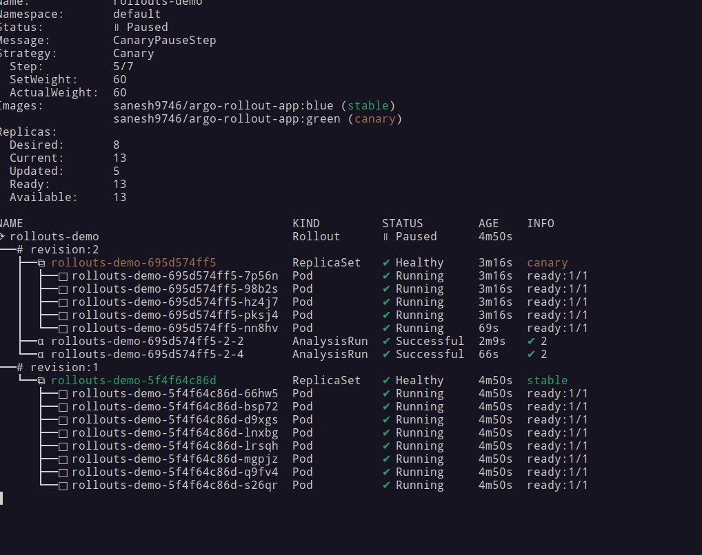
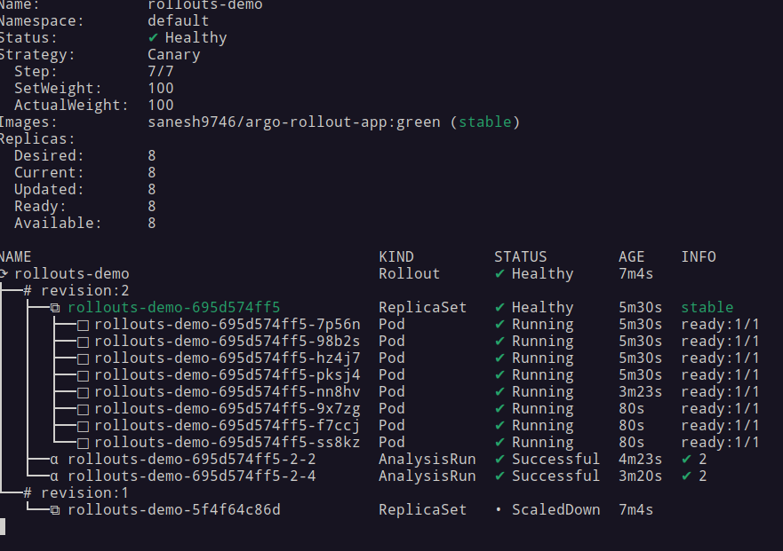
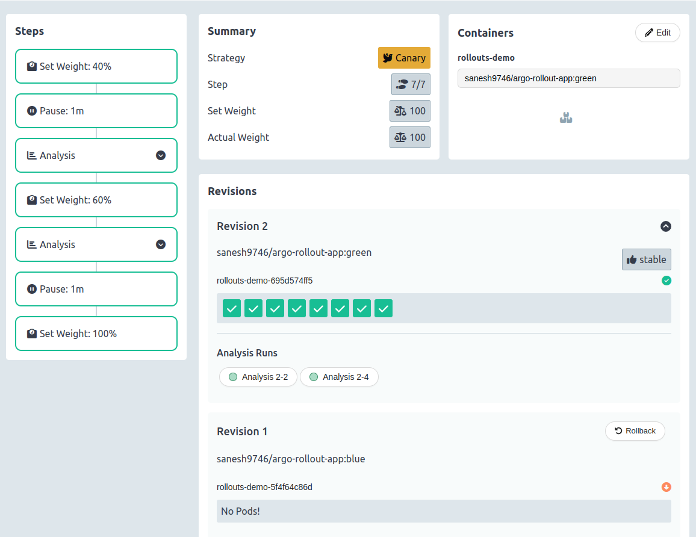

# Using Kong Gateway with Argo Rollouts

## Step 1 - Install Argo Rollouts and the API Gateway Plugin

See [instructions](https://rollouts-plugin-trafficrouter-gatewayapi.readthedocs.io/en/latest/installation/).

## Step 2 - Install Kong Gateway APIs

Install kubernetes api gateway for the cluster. See [instructions](https://docs.konghq.com/kubernetes-ingress-controller/3.4.x/get-started/)

## Step 3 - Create Gateway and Gateway class

Gateway

```yaml
apiVersion: gateway.networking.k8s.io/v1
kind: Gateway
metadata:
  name: kong
spec:
  gatewayClassName: kong
  listeners:
  - name: proxy
    port: 80
    protocol: HTTP
    allowedRoutes:
      namespaces:
         from: All
```

GatewayClass

```yaml
apiVersion: gateway.networking.k8s.io/v1
kind: GatewayClass
metadata:
  name: kong
  annotations:
    konghq.com/gatewayclass-unmanaged: 'true'

spec:
  controllerName: konghq.com/kic-gateway-controller
```


## Step 4 - Give access to Argo Rollouts for the Gateway/Http Route


Cluster Role

```yaml
apiVersion: rbac.authorization.k8s.io/v1
kind: ClusterRole
metadata:
  name: gateway-controller-role
  namespace: argo-rollouts
rules:
  - apiGroups:
      - "*"
    resources:
      - "*"
    verbs:
      - "*"
```

Note that these permission are not very strict. You should lock them down according to your needs.

ClusterRoleBinding

```yaml
apiVersion: rbac.authorization.k8s.io/v1
kind: ClusterRoleBinding
metadata:
  name: gateway-admin
roleRef:
  apiGroup: rbac.authorization.k8s.io
  kind: ClusterRole
  name: gateway-controller-role
subjects:
  - namespace: argo-rollouts
    kind: ServiceAccount
    name: argo-rollouts
```

Note: With the service account 'argo-rollouts' argo rollout gt access to httproute

## Step 5 - Create HTTPRoute that defines a traffic split between two services

Create HTTPRoute and connect to the created Gateway resource

```yaml
kind: HTTPRoute
apiVersion: gateway.networking.k8s.io/v1beta1
metadata:
  name: argo-rollouts-http-route
  labels:
    app: argo-rollouts-http-route
  annotations:
    konghq.com/strip-path: 'true'
spec:
  parentRefs:
  - kind: Gateway
    name: kong
  hostnames:
  - "demo.example.com"
  rules:
  - matches:
    - path:
        type: PathPrefix
        value: /
    backendRefs:
    - name: argo-rollouts-stable-service
      kind: Service
      port: 80
    - name: argo-rollouts-canary-service
      kind: Service
      port: 80
---
apiVersion: v1
kind: Service
metadata:
  name: argo-rollouts-stable-service               ### Stable service
spec:
  ports:
    - port: 80
      targetPort: http
      protocol: TCP
      name: http
  selector:
    app: rollouts-demo
---
apiVersion: v1
kind: Service
metadata:
  name: argo-rollouts-canary-service          ### Canary Service
  labels:
    app: argo-rollouts-canary-service
  annotations:
    prometheus.io/scrape: "true"
spec:
  ports:
    - port: 80
      targetPort: http
      protocol: TCP
      name: http
  selector:
    app: rollouts-demo
```
## Step 6 - Create Rollout

```yaml
apiVersion: argoproj.io/v1alpha1
kind: Rollout
metadata:
  name: rollouts-demo
  namespace: default
spec:
  replicas: 8
  strategy:
    canary:
      canaryService: argo-rollouts-canary-service # canary svc
      stableService: argo-rollouts-stable-service # stable svc
      trafficRouting:
        plugins:
          argoproj-labs/gatewayAPI:
            httpRoute: argo-rollouts-http-route # httproute
            namespace: default
      steps:
        - setWeight: 40
        - pause: {duration: 1m}
        - analysis:
            templates:
            - templateName: success-rate-canary-service    # checks success rate of traffic through canary service
            args:
            - name: service-name
              value: argo-rollouts-canary-service 
        - setWeight: 60
        - pause: {duration: 1m}
        - analysis:
            templates:
            - templateName: success-rate-gateway          # checks success rate of traffic through in gateway api
            args:
            - name: httproute
              value: httproute.default.argo-rollouts-http-route.0.0 
        - pause: {duration: 1m}
        - setWeight: 100
  revisionHistoryLimit: 2     # Keeps 2 revisions active
  selector:
    matchLabels:
      app: rollouts-demo
  template:
    metadata:
      labels:
        app: rollouts-demo
    spec:
      serviceAccountName: pod-access-sa  # Service account for application to access the cluster
      containers:
        - name: rollouts-demo
          image: sanesh9746/argo-rollout-app:green   # Image for demo application
          imagePullPolicy: Always
          ports:
            - name: http
              containerPort: 5000
              protocol: TCP
          resources:
            requests:
              memory: 32Mi
              cpu: 5m
```

- Canary rollout steps

```yaml
      steps:
        - setWeight: 40
        - pause: {duration: 1m}
        - analysis:
            templates:
            - templateName: success-rate-canary-service    # checks success rate of traffic through canary service
            args:
            - name: service-name
              value: argo-rollouts-canary-service 
        - setWeight: 60
        - pause: {duration: 1m}
        - analysis:
            templates:
            - templateName: success-rate-gateway          # checks success rate of traffic through in gateway api
            args:
            - name: httproute
              value: httproute.default.argo-rollouts-http-route.0.0 
        - pause: {duration: 1m}
        - setWeight: 100
```

1. **Set Weight:** 40  
2. **Pause:** `{duration: 1m}`  
3. **Analysis:** Check success rate of traffic through canary service  
4. **Set Weight:** 60  
5. **Pause:** `{duration: 1m}`  
6. **Analysis:** Check success rate of traffic through Gateway API  
7. **Pause:** `{duration: 1m}`  
8. **Set Weight:** 100  

- Analysis template

##### To check success rate of traffic through canary service

```yaml
apiVersion: argoproj.io/v1alpha1
kind: AnalysisTemplate
metadata:
  name: success-rate-canary-service
spec:
  args:
  - name: service-name
  metrics:
  - name: success-rate-canary-service
    interval: 1m
    count: 2
    successCondition: result[0] >= 0.90
    failureLimit: 1
    provider:
      prometheus:
        address: http://prometheus-nodeport.monitoring.svc.cluster.local:9090
        query: sum(rate(http_requests_total{service="argo-rollouts-canary-service", status_code!~"5.."}[1m])) / sum(rate(http_requests_total{service="argo-rollouts-canary-service"}[1m]))
```

##### To check success rate of traffic through in gateway api

```yaml
apiVersion: argoproj.io/v1alpha1
kind: AnalysisTemplate
metadata:
  name: success-rate-gateway
spec:
  args:
  - name: httproute
  metrics:
  - name: success-rate-gateway
    interval: 1m
    count: 2
    successCondition: result[0] >= 0.90
    failureLimit: 1
    provider:
      prometheus:
        address: http://prometheus-nodeport.monitoring.svc.cluster.local:9090
        query: sum(rate(kong_http_requests_total{route="{{args.httproute}}", code!~"5.."}[1m])) / sum(rate(kong_http_requests_total{route="{{args.httproute}}"}[1m]))
```


# Canary deployment of Demo application using argo rollout

### Deploying version 1 of the application

#### Argo Dashboard




#### Watching the rollout in command line
`kubectl argo rollouts get rollout rollouts-demo --watch`


#### Performing canary update to version 2

- Setting weight to 60




- Performing 1st analysis 

  


- Performing 2nd analysis




- Completed anaysis and rolled out to version 2


# Canary_deployment_argo_rollout_kong_gateway_api
